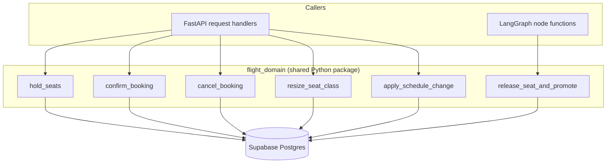
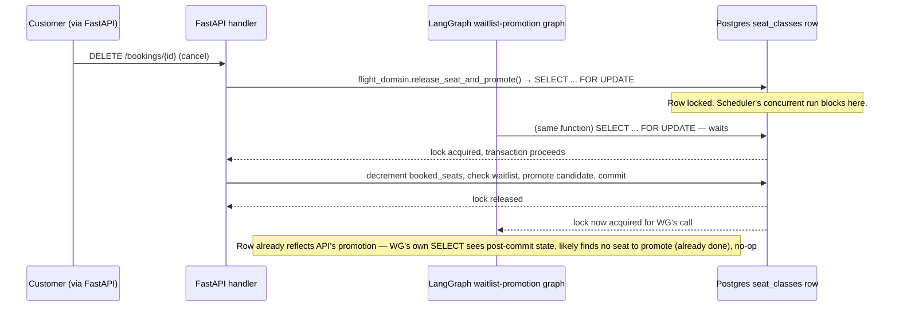
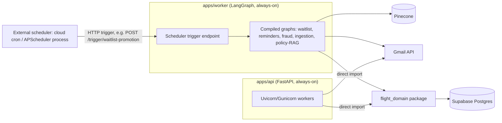

# System Architecture — Flight Management System (FastAPI + LangGraph + Postgres)

This doc resolves the one problem the original spec named but didn't solve: **two systems writing to the same tables with no shared contract.** Swapping n8n for LangGraph does not fix this by itself — a LangGraph worker calling `psycopg` directly against the same tables has exactly the same failure mode n8n did. The fix below is independent of which background engine you use.

## 1. The fix: one shared domain package, two callers



Every mutation that touches `flights`, `seat_classes`, `bookings`, or `waitlist_entries` goes through one of a small set of functions in a package literally named `flight_domain`, imported by **both** the FastAPI app and the LangGraph worker process. Neither system writes raw SQL against these four tables anywhere else. This is what makes "shared contract" true instead of aspirational — it's enforceable in code review (grep for raw `UPDATE seat_classes` outside `flight_domain/` and reject the PR), not a convention anyone has to remember.

**Deployment shape:** one monorepo, three deployables:
```
repo/
  packages/flight_domain/      # shared: SQLAlchemy models, the mutation functions, validation
  apps/api/                    # FastAPI — imports flight_domain directly (same process)
  apps/worker/                 # LangGraph graphs + a small scheduler-trigger endpoint — imports flight_domain directly (separate process, same package)
```
Both `apps/api` and `apps/worker` run in the same Python environment/image family and import `flight_domain` as a local package — no network hop, no internal HTTP API, no duplicate logic. If your org requires `apps/worker` to be a fully separate team/deployment with a hard network boundary, replace the direct import with calls to a small **internal-only** FastAPI router (`/internal/...`, service-token auth, not in the public OpenAPI schema) that wraps the same `flight_domain` functions — the contract stays identical either way; only the transport changes. Default to the direct-import version unless you have a concrete reason not to.

Each `flight_domain` function is one thing: a validated, transactional unit of work. Example shape (full signatures/bodies belong in the actual codebase, not this doc — but the pattern is fixed):

```python
# packages/flight_domain/seats.py
def release_seat_and_promote(conn, *, flight_id: str, seat_class_id: str) -> DomainEvent:
    with conn.begin():
        row = conn.execute(
            "SELECT * FROM seat_classes WHERE id = %s FOR UPDATE",
            [seat_class_id],
        ).fetchone()
        # ... decrement booked_seats, check waitlist_entries for next candidate ...
        # ... if a candidate exists: insert booking, update waitlist_entries.status ...
        # ... insert into domain_events in the SAME transaction ...
    return event
```

The `SELECT ... FOR UPDATE` and the subsequent write live in the **same function, same transaction, same connection** — never split across two round trips, and never split across two LangGraph nodes if a node boundary would mean two separate connection checkouts. This is the exact failure mode n8n had (lock released back to the pool between visual-workflow steps); it is *possible* to reintroduce the same bug in LangGraph if a node does the `SELECT FOR UPDATE` and a later node does the `UPDATE` — so: **one node, one function call, one transaction**, whenever atomicity matters. LangGraph's graph structure is for orchestration and branching between atomic steps, not for splitting an atomic step in two.

## 2. Two locking patterns — don't conflate them

| Table | Contention shape | Lock to use | Why |
|---|---|---|---|
| `seat_classes` (booked/held count) | One shared counter, every writer must eventually apply their update | `SELECT ... FOR UPDATE` (blocking) | Skipping is wrong here — there is only one row and it must be updated, not bypassed |
| `domain_events` (outbox, consumed by LangGraph schedulers) | Many independent rows, many possible workers, each row processed once | `SELECT ... FOR UPDATE SKIP LOCKED` | Correct to skip a row another worker already has — grab a *different* row instead of blocking |
| `waitlist_entries` (promotion candidates) | Same as above — a batch of candidates, one worker per candidate | `SELECT ... FOR UPDATE SKIP LOCKED` | Same reasoning as `domain_events` |

The original spec's single bullet ("row-locking strategy: SELECT FOR UPDATE SKIP LOCKED") conflated these. Both are needed; they solve different problems.

## 3. Conflict resolution, worked through the named example

> "FastAPI cancellation vs. LangGraph waitlist promotion on the same seat" — the original spec's own example of what needs an explicit rule.



There is no separate "conflict-resolution rule" to write in prose, because both callers run the *same function*. Postgres's row lock is the arbiter: whichever transaction commits first is authoritative, and the second caller's `SELECT` (inside the same function) simply reads the post-commit state and (correctly) finds nothing left to do. This is the concrete answer to the PRD item that was previously just a named risk.

## 4. Idempotency

- `idempotency_keys(key PK, endpoint, request_hash, response_snapshot_json, created_at)`.
- Every mutating FastAPI endpoint requires an `Idempotency-Key` header. `flight_domain` checks this table first, inside the same transaction as the mutation, and returns the stored response snapshot on replay instead of re-running the mutation.
- Webhook idempotency (payments) uses the same pattern keyed on the provider's event id (`payment_webhook_events`), not a client-supplied key — the provider is the one that redelivers.

## 5. Change-detection: the outbox

`domain_events(id, event_type, payload_json, created_at, processed boolean, processed_at)`. Every `flight_domain` function that changes state worth reacting to writes one row here, in the same transaction as the state change. Event types: `seat_released`, `booking_confirmed`, `booking_cancelled`, `refund_requested`, `flight_cancelled`, `schedule_changed`.

LangGraph schedulers consume this table (`SELECT ... FOR UPDATE SKIP LOCKED WHERE processed = false ORDER BY created_at LIMIT N`) instead of polling `bookings`/`seat_classes` directly and trying to infer "did anything change." This also gives you `LISTEN/NOTIFY` for free if you want lower latency than polling: have the same insert also `NOTIFY domain_events, '<id>'` and have the worker hold a `LISTEN` connection, falling back to the poll query on reconnect. Polling every 10–30s is a perfectly reasonable default for a capstone; don't build LISTEN/NOTIFY unless the reminder/promotion latency genuinely needs to be sub-second.

## 6. RAG grounding — summary (full design in `05_langgraph_rag_pinecone.md`)

The approval gate alone doesn't verify facts — it verifies "did a human look at this." The fix adds a step *before* the human ever sees the draft: fetch the booking's fare rule from Postgres as structured ground truth, retrieve general policy passages from Pinecone filtered to that fare type, generate the draft with both clearly labeled and the DB record marked authoritative, then run a deterministic **consistency check** (structured-output diff against `fare_rules`, not another LLM call) before the human-approval interrupt. A human reviewing a pre-checked draft is reviewing tone and completeness, which is what the approval gate is actually good at; the consistency check is what catches "fluent and wrong."

## 7. Reconciliation

`[LangGraph]` scheduled graph, hourly: `seat_classes.booked_seats` vs. `count(*) FROM bookings WHERE seat_class_id = ? AND status = 'confirmed'`, per class. Any mismatch writes an `audit_log` entry with actor `system:reconciliation` and — for a capstone — just alerts (log/email to ops); doesn't auto-correct. Auto-correction is a v3 problem; detection is the v2 requirement.

## 8. Deployment topology



`apps/worker` exposes a minimal set of trigger endpoints (`/trigger/waitlist-promotion`, `/trigger/checkin-reminders`, `/trigger/fraud-scan`, `/trigger/pinecone-ingest`) that do nothing but call `graph.invoke()` for the corresponding compiled graph. An external scheduler calls these on a schedule. This keeps you from depending on LangGraph Platform's managed cron (a paid/licensed feature) for a self-hosted capstone deployment; swap in LangGraph Platform's `client.crons.create(...)` later if you deploy there instead — the graphs themselves don't change, only what calls `.invoke()`.

Full config values, Supabase pooling gotchas, and Gmail credentials setup: `06_configuration_deployment.md`.
