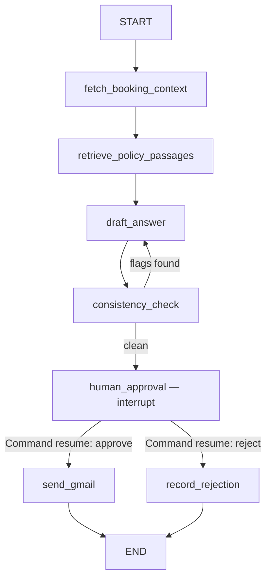

# LangGraph Flows + RAG/Pinecone Configuration

Every graph below imports `flight_domain` directly for any Postgres write that touches `flights`/`seat_classes`/`bookings`/`waitlist_entries` — see `02_system_architecture.md` §1. A graph node is never the place raw SQL for those four tables lives.

Honest caveat up front: waitlist promotion, check-in reminders, fraud scoring, and Pinecone ingestion have no LLM call in them at all — they're deterministic jobs. Modeling them as LangGraph graphs (rather than plain scheduled Python functions) is done for *consistency* — one checkpointing/observability/retry story across every background job, matching "replace n8n with LangGraph everywhere" — not because they need an LLM. If that consistency isn't worth the abstraction to you, these four are equally correct as plain functions behind the same trigger endpoints; only the policy-RAG graph structurally needs LangGraph's `interrupt()`.

## 1. Checkpointing setup (shared across all graphs)

```python
# apps/worker/checkpointer.py
from langgraph.checkpoint.postgres import PostgresSaver

# IMPORTANT: use Supabase's SESSION pooler (port 5432) or a direct connection here,
# NOT the transaction-mode pooler (port 6543) — see 06_configuration_deployment.md
# for why transaction mode breaks prepared-statement-dependent libraries like psycopg
# used by PostgresSaver. If you must use transaction mode, set prepare_threshold=None
# on the underlying psycopg connection.
DB_URI = settings.LANGGRAPH_CHECKPOINT_DB_URI

checkpointer = PostgresSaver.from_conn_string(DB_URI)
checkpointer.setup()   # idempotent; creates the checkpoint tables on first run only
```

Every graph is compiled with this checkpointer:
```python
graph = builder.compile(checkpointer=checkpointer)
```

`thread_id` convention: for the policy-RAG graph, `thread_id = policy_question_runs.id` (so the run is resumable by that id from the approval endpoint). For the four batch jobs, each scheduled invocation gets a fresh `thread_id` (e.g. `f"waitlist-promo-{run_timestamp}"`) — they don't need to resume across runs, only within a single run if it crashes mid-way.

## 2. Policy RAG graph — the one that needs `interrupt()`



```python
# apps/worker/graphs/policy_rag.py
from typing import TypedDict
from langgraph.graph import StateGraph, START, END
from langgraph.types import interrupt, Command

class PolicyRunState(TypedDict):
    run_id: str
    booking_id: str | None
    customer_question: str
    booking_context: dict | None       # ground-truth fare rule, from Postgres
    retrieved_passages: list[dict]     # general policy text, from Pinecone
    draft_answer: str | None
    consistency_flags: list[str]
    final_answer: str | None
    decision: str | None               # 'approve' | 'reject', set on resume

def fetch_booking_context(state: PolicyRunState) -> dict:
    if not state["booking_id"]:
        return {"booking_context": None}
    ctx = flight_domain.get_fare_rule_for_booking(state["booking_id"])  # plain read, no lock needed
    return {"booking_context": ctx}

def retrieve_policy_passages(state: PolicyRunState) -> dict:
    fare_type = state["booking_context"]["fare_class"] if state["booking_context"] else "all"
    passages = pinecone_client.query_policy(
        query_text=state["customer_question"],
        fare_type_filter=fare_type,
    )
    return {"retrieved_passages": passages}

def draft_answer(state: PolicyRunState) -> dict:
    # Structured output, not free text — the fields below are what consistency_check diffs
    # against booking_context. See "Grounding implementation" section further down.
    result = llm_structured_draft(
        question=state["customer_question"],
        ground_truth=state["booking_context"],
        general_policy=state["retrieved_passages"],
    )
    return {"draft_answer": result.answer_text, "_structured_claims": result.claims}

def consistency_check(state: PolicyRunState) -> dict:
    flags = diff_claims_against_ground_truth(state["_structured_claims"], state["booking_context"])
    return {"consistency_flags": flags}

def route_after_check(state: PolicyRunState) -> str:
    return "redraft" if state["consistency_flags"] else "approve"

def human_approval(state: PolicyRunState) -> dict:
    # Re-executes from the top of THIS node on resume — keep everything above this
    # line in the node side-effect-free (it is: this node only reads state and pauses).
    decision = interrupt({
        "run_id": state["run_id"],
        "draft_answer": state["draft_answer"],
        "consistency_flags": state["consistency_flags"],
    })
    return {"decision": decision["action"], "final_answer": decision.get("edited_answer") or state["draft_answer"]}

def send_gmail(state: PolicyRunState) -> dict:
    gmail_client.send(to=..., body=state["final_answer"])
    return {}

builder = StateGraph(PolicyRunState)
builder.add_node("fetch_booking_context", fetch_booking_context)
builder.add_node("retrieve_policy_passages", retrieve_policy_passages)
builder.add_node("draft_answer", draft_answer)
builder.add_node("consistency_check", consistency_check)
builder.add_node("human_approval", human_approval)
builder.add_node("send_gmail", send_gmail)
builder.add_node("record_rejection", lambda s: {})

builder.add_edge(START, "fetch_booking_context")
builder.add_edge("fetch_booking_context", "retrieve_policy_passages")
builder.add_edge("retrieve_policy_passages", "draft_answer")
builder.add_edge("draft_answer", "consistency_check")
builder.add_conditional_edges("consistency_check", route_after_check,
                               {"redraft": "draft_answer", "approve": "human_approval"})
builder.add_conditional_edges("human_approval", lambda s: s["decision"],
                               {"approve": "send_gmail", "reject": "record_rejection"})
builder.add_edge("send_gmail", END)
builder.add_edge("record_rejection", END)

policy_graph = builder.compile(checkpointer=checkpointer)
```

**Invocation (from `POST /policy/questions`):**
```python
result = policy_graph.invoke(
    {"run_id": run_id, "booking_id": booking_id, "customer_question": question,
     "retrieved_passages": [], "consistency_flags": [], "decision": None, "final_answer": None,
     "draft_answer": None, "booking_context": None},
    config={"configurable": {"thread_id": run_id}},
)
# result will contain __interrupt__ once it reaches human_approval — that's the signal
# to write policy_question_runs.status = 'pending_approval' and surface it in
# GET /internal/policy/pending.
```

**Resuming (from `POST /internal/policy/{run_id}/approve`):**
```python
policy_graph.invoke(
    Command(resume={"action": "approve", "edited_answer": edited_answer_or_none}),
    config={"configurable": {"thread_id": run_id}},
)
```

⚠️ **Gotcha, stated plainly:** on resume, LangGraph re-executes the `human_approval` node from its start — this is fine here because that node does nothing but read state and call `interrupt()`. If you ever add a side effect (an API call, a DB write) *before* the `interrupt()` call inside a node, that side effect re-runs every time the node resumes evaluation, which is very likely not what you want. Keep every node containing an `interrupt()` free of side effects before the call, or make those side effects idempotent.

## 3. Grounding implementation (the fix for the original spec's gap)

`draft_answer` asks the LLM for **structured output**, not prose to keyword-scan:
```python
class DraftClaims(BaseModel):
    answer_text: str
    cited_refundable: bool | None = None
    cited_change_fee_amount: float | None = None
    cited_cancellation_window_hrs: int | None = None

def diff_claims_against_ground_truth(claims: DraftClaims, ground_truth: dict | None) -> list[str]:
    if ground_truth is None:
        return []   # no specific booking referenced — nothing to ground against
    flags = []
    if claims.cited_refundable is not None and claims.cited_refundable != ground_truth["refundable"]:
        flags.append(f"draft claims refundable={claims.cited_refundable}, fare_rules says {ground_truth['refundable']}")
    if claims.cited_change_fee_amount is not None and claims.cited_change_fee_amount != ground_truth["change_fee_amount"]:
        flags.append("draft's stated change fee doesn't match fare_rules.change_fee_amount")
    # ... same pattern for cancellation window ...
    return flags
```
This is deterministic and cheap — no second LLM call — and it's what actually closes the gap the original spec's approval gate left open: the human now reviews a draft that's already been checked against the database, not a fluent guess.

## 4. Waitlist promotion graph

```python
class WaitlistPromoState(TypedDict):
    candidates: list[dict]   # freed seat_class_ids to check this run

def find_freed_seats(state):
    events = flight_domain.claim_unprocessed_events(event_type="seat_released", limit=50)
    return {"candidates": events}

def promote_each(state):
    for event in state["candidates"]:
        flight_domain.release_seat_and_promote(seat_class_id=event["seat_class_id"])  # idempotent no-op if already handled
    return {}

builder = StateGraph(WaitlistPromoState)
builder.add_node("find_freed_seats", find_freed_seats)
builder.add_node("promote_each", promote_each)
builder.add_edge(START, "find_freed_seats")
builder.add_edge("find_freed_seats", "promote_each")
builder.add_edge("promote_each", END)
waitlist_graph = builder.compile(checkpointer=checkpointer)
```
`claim_unprocessed_events` does `SELECT ... FOR UPDATE SKIP LOCKED` against `domain_events` (queue-style lock — see the locking table in `02_system_architecture.md` §2), marks them `processed=true` in the same transaction it reads them, so a crash mid-run reprocesses at most the in-flight batch, never the whole backlog.

## 5. Check-in reminder graph

```python
def find_upcoming_flights(state):
    # departure_at between now+23h and now+25h, status='scheduled' — one pass covers the
    # "already cancelled -> suppress" rule for free by filtering on status here, not as
    # a separate cleanup pass (PRD §6).
    return {"flights": flight_domain.flights_needing_checkin_reminder()}

def send_reminders(state):
    for f in state["flights"]:
        local_dep = f["departure_at"].astimezone(ZoneInfo(f["origin_tz"]))
        gmail_client.send_checkin_reminder(flight=f, local_departure=local_dep)
    return {}
```
Timezone correctness comes from `origin_tz` stored on the flight row (PRD §13) — never from server-local time.

## 6. Fraud scan graph

```python
def score_recent_bookings(state):
    bookings = flight_domain.bookings_since_last_scan()
    for b in bookings:
        score, signals = fraud_model.score(b)
        flight_domain.record_fraud_score(b["id"], score, signals)  # insert only, no seat/booking mutation
    return {}
```
Fraud writes only to `fraud_scores` — it never mutates `bookings`/`seat_classes`, so it doesn't need the shared-lock discipline the seat-touching functions do; it's append-only.

## 7. Pinecone ingestion graph

```python
def find_changed_docs(state):
    return {"docs": flight_domain.policy_docs_changed_since_last_ingest()}  # content_hash comparison

def chunk_and_embed(state):
    for doc in state["docs"]:
        chunks = chunk_text(doc["policy_text"], target_tokens=300, overlap_tokens=50)
        vectors = embedding_model.embed_batch([c.text for c in chunks])
        index.upsert(
            vectors=[(f"{doc['id']}-{i}", v, {"fare_type": doc["fare_type_scope"], "policy_category": doc["category"]})
                      for i, v in enumerate(vectors)],
            namespace="policy-docs",
        )
        flight_domain.record_chunk_ingestion(doc["id"], chunks)  # writes policy_doc_chunks rows
    return {}
```

## 8. Pinecone index configuration

```python
from pinecone import Pinecone, ServerlessSpec, CloudProvider, AwsRegion, VectorType

pc = Pinecone(api_key=settings.PINECONE_API_KEY)

pc.create_index(
    name="fms-policy-docs",
    dimension=1536,                 # match your embedding model's output dimension exactly
    metric="cosine",
    spec=ServerlessSpec(cloud=CloudProvider.AWS, region=AwsRegion.US_EAST_1),
    vector_type=VectorType.DENSE,
)
index = pc.Index(host=index_host)
```
- **Namespace:** single `policy-docs` namespace is enough at this scale; split further only if you later add a second, unrelated corpus (e.g. FAQ vs. fare-rule docs) and want to query them independently.
- **Metadata schema:** `fare_type` (`"basic_economy" | "flexible_economy" | "business" | "first" | "all"`) and `policy_category` (`"cancellation" | "change" | "baggage" | "refund" | "general"`). Both are filter fields, not just descriptive — `retrieve_policy_passages` filters on `fare_type IN [booking's fare_type, "all"]` so a basic-economy customer's question never surfaces business-class-only passages (this is the "generic match" failure mode the original spec named, addressed at the retrieval layer, not just the prompt layer).
- **Chunking:** ~300 tokens with 50-token overlap is a reasonable default for policy prose; re-tune based on how your actual `fare_rules.policy_text` reads once written.
- **Integrated inference option:** Pinecone also supports index-integrated embedding (the index embeds on upsert/query itself, so you don't run your own embedding model). Either approach works here; running your own embedding call (as shown above) makes it easier to reuse the same embedding model for the query side and keep the two in lockstep — pick integrated inference instead if you'd rather not manage an embedding client at all.

## 9. Scheduling — two options, pick one per deployment

**Option A — self-hosted (default for a capstone):** an external scheduler (APScheduler process, or your cloud provider's scheduled-function trigger) calls the `apps/worker` trigger endpoints on a cron schedule:
```python
# apps/worker/main.py (FastAPI app just for triggers, separate from apps/api)
@app.post("/trigger/waitlist-promotion")
def trigger_waitlist_promotion():
    waitlist_graph.invoke({"candidates": []}, config={"configurable": {"thread_id": f"wl-{utcnow()}"}})
```
```python
# a tiny standalone APScheduler process, or a cloud scheduler hitting the same URL
scheduler.add_job(lambda: requests.post(f"{WORKER_URL}/trigger/waitlist-promotion"), "interval", minutes=2)
scheduler.add_job(lambda: requests.post(f"{WORKER_URL}/trigger/checkin-reminders"), "cron", hour=6)
scheduler.add_job(lambda: requests.post(f"{WORKER_URL}/trigger/fraud-scan"), "cron", hour="*/4")
scheduler.add_job(lambda: requests.post(f"{WORKER_URL}/trigger/pinecone-ingest"), "cron", hour=3)
scheduler.add_job(lambda: requests.post(f"{WORKER_URL}/trigger/refund-escalation"), "cron", hour=9)
```

**Option B — LangGraph Platform managed cron (if you deploy there instead of self-hosting `apps/worker`):**
```python
cron_job = await client.crons.create(
    assistant_id="waitlist-promotion",
    schedule="*/2 * * * *",   # UTC
    input={},
)
```
This is a licensed/managed feature, not available on every LangGraph Platform plan — confirm availability before depending on it. The graphs themselves are identical either way; only what calls `.invoke()` changes.
